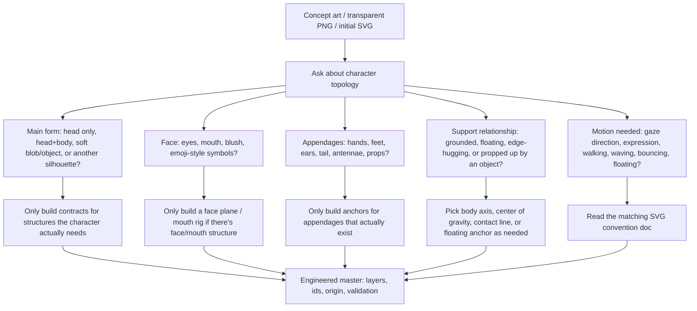

# pet-forge

Tools, templates, and workflow docs for building custom SVG / APNG desktop pets.

pet-forge can be used as a standalone toolkit or as a Codex skill. It isn't a finished character pack — it's a reusable set of route guides, prompt templates, SVG conventions, APNG post-processing scripts, examples, and state-mapping notes.

## Routes

```
[SVG Route]                         [APNG Route]

Reference image                     Prompt template
   -> background removal               -> AI reference image
   -> PNG to SVG                       -> AI video anchored on first/last frame
   -> preset + SVG template            -> chroma key
   -> self-contained .svg.html         -> .apng
```

| Aspect | SVG Route | APNG Route |
|---|---|---|
| Cost | Free once your local environment is set up | Uses a free or paid generation API |
| Controllability | High — every keyframe is editable | Lower — reruns are common |
| Looping | Precise CSS loops | Depends on first/last-frame anchoring |
| File size | Usually small | Usually hundreds of KB or more |
| Best for | Crisp vector pets, small runtime files | Rich visual styles, fast drafts |

If you want precise loops, small files, and editable animation logic, choose SVG.

If you want to quickly explore rich visual styles and are fine with a generation API and post-processing, choose APNG.

## Using It as a Codex Skill

This repo includes `SKILL.md`, so Codex can use pet-forge as a skill when planning or building SVG / APNG desktop pet assets. The skill steers Codex toward the route docs, templates, tools, examples, and constraints in this repo, instead of treating the task as generation from scratch.

Use it when you want Codex to help you choose a route, convert a transparent PNG to SVG, prepare an APNG generation prompt, post-process a generated video into an APNG, or wire up a small runnable demo.

## Inventory Character Topology First

Before applying head, appendage, mouth, or body conventions, inventory what structure the character actually has. Don't assume every desktop pet has a full head, body, hands, feet, and mouth.



For example: a head-only character might need a face plane and expression rules but no foot rig; a soft-blob character might need a silhouette axis, floating anchor, and squash rules but no mouth; a full mascot might need face, body, appendage, and expression contracts all at once.

## Demo: Same Reference Image, Two SVG Routes

Using the same reference image, compare pet-forge's two ways of getting to SVG: the tooling route (png2svg + vtracer tracing) versus handing it directly to GPT-5.5 Pro.

<table>
  <tr>
    <th align="center" width="33%">Reference · Source PNG</th>
    <th align="center" width="33%">Tooling Route · <code>png2svg + vtracer</code></th>
    <th align="center" width="34%">GPT-5.5 Pro · Direct Generation</th>
  </tr>
  <tr>
    <td align="center"></td>
    <td align="center"></td>
    <td align="center"></td>
  </tr>
  <tr>
    <td align="center">A true alpha-transparent PNG. Don't use a screenshot with a checkerboard background — it will get vectorized too.</td>
    <td align="center">After cleaning up transparent pixels and limiting the color count, vtracer traces paths by color region. The silhouette comes through well, but eye highlights, the smiling mouth, and the tongue get flattened, and the paths carry no semantics.</td>
    <td align="center">A structured SVG the model redrew from scratch: gradient body, clean facial features, named layers. Closer to a finished asset, but it's the model's own interpretation, not a pixel-accurate trace.</td>
  </tr>
</table>

| Dimension | Tooling Route (vtracer trace) | GPT-5.5 Pro Direct Generation |
|---|---|---|
| Input | Transparent PNG | Reference image (optionally with a text description) |
| Path count | 13 anonymous paths | 15 paths with semantic ids |
| File size | ~21 KB | ~12 KB |
| Structure | Flat, no grouping | Grouped (`plant-and-limbs` / `body` / `face`), named layers |
| Fill | Solid colors | Gradients + Gaussian blur + `clipPath` |
| Animatability | Low — paths carry no semantics, hard to bind by part | High — eyes / mouth / arms / legs can be driven independently |
| Fidelity | Silhouette close to the source; facial detail is lossy | The model's own interpretation, not a pixel-level trace |
| Accessibility | None | Includes `title` / `desc` (ARIA) |

**If you have the option, we recommend generating SVG directly with a frontier model like GPT-5.5 Pro first**: the output has cleaner structure, is already layered, and can be bound to animation right away. If that's not available, the tooling route (vtracer tracing) is a perfectly usable fallback — it just needs manual cleanup on details like the face afterward. Either output can be copied into `routes/svg/templates/hello-idle.svg.html` to tune CSS variables and animation.

To reproduce the tooling route (from the repo root):

```powershell
py -3.13 routes\svg\tools\png2svg\png2svg.py examples\svg-gpt-pear\source.png examples\svg-gpt-pear\pear.svg --preset apple-precise
```

This run produced 13 SVG paths at ~21 KB. The key requirement is that the source image must be a truly transparent PNG; a screenshot with a checkerboard background will vectorize the checkerboard too, and the output will be poor.

Runnable files:

- Reference image (source PNG): `examples/svg-gpt-pear/source.png`
- Tooling-route SVG: `examples/svg-gpt-pear/pear.svg`
- GPT-5.5 Pro SVG: `examples/svg-gpt-pear/pear-gpt-5.5-pro.svg` (generated directly by GPT-5.5 Pro, with the white background removed in favor of transparency)
- Runnable idle demo: `examples/svg-gpt-pear/idle.svg.html`

`examples/svg-soft-orb/` is a smaller synthetic benchmark demo used to compare a hand-made low-color-count source image against a GPT-generated source image.

## Quick Start

### SVG Route

```powershell
git clone <pet-forge-repo>
cd pet-forge

# Open the starter SVG pet in your browser:
# routes\svg\templates\hello-idle.svg.html

# Optional: if your PNG doesn't have a transparent background, remove it first.
py -3.13 -m pip install "rembg[cpu,cli]"
py -3.13 -m rembg i your-character.png your-character-clean.png

py -3.13 -m pip install Pillow numpy scipy vtracer
py -3.13 routes\svg\tools\png2svg\png2svg.py your-character-clean.png character.svg --preset apple-precise
```

Then copy the generated SVG paths into `routes/svg/templates/hello-idle.svg.html` and tune the CSS variables and preset.

The PNG-to-SVG step uses vtracer as the vectorization engine. It works best on simple, low-color, clean-edged graphics; complex photos, gradients, fur, textures, and noisy edges can produce huge or poor-quality SVGs. When the source image is complex, prefer the APNG route, or manually redraw the key SVG structures.

### APNG Route

```powershell
git clone <pet-forge-repo>
cd pet-forge\routes\apng\tools

npm install
py -3 -m pip install Pillow numpy

copy .env.example .env
# Fill in your API key in .env.

node test-api.js
node gen-images.js --prompt "A cute chibi ..." --output reference/main-ref.png --api doubao
node gen-video.js idle-dozing --image reference/main-ref.png --last-frame reference/main-ref.png --api doubao
```

If you need to manually rerun the chroma key step:

```powershell
py chroma_key.py output/idle-dozing/doubao-video.mp4 output/idle-dozing/result.apng --plays 0
```

## Repository Layout

```
pet-forge/
├── README.md
├── SKILL.md
├── CLAUDE.md
├── routes/
│   ├── svg/
│   │   ├── presets/
│   │   ├── templates/
│   │   ├── conventions/
│   │   ├── lessons/
│   │   └── tools/png2svg/
│   └── apng/
│       ├── prompts/
│       ├── conventions/
│       ├── lessons/
│       └── tools/
├── shared/
└── examples/
```

## What This Repository Does Not Do

- Does not include finished character assets.
- Does not ship private source project files.
- Does not provide API keys or pay for generation services on your behalf.
- Does not decide final aesthetics for you.
- Does not promise one-click generation of a complete multi-state pet.

## License

The documentation, templates, and original wrapper code in this repository are licensed under MIT. See [LICENSE](LICENSE).

Some scripts are adapted from earlier internal prototypes; when published, appropriate source and attribution notes should be preserved where applicable. Character designs, generated images, and product assets are kept separate from this toolkit and are not included in the repository.
